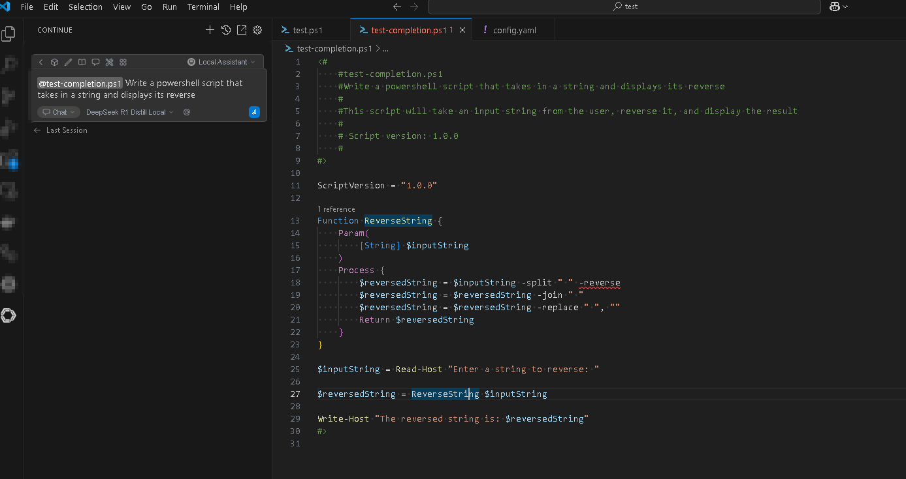

# Continue + Local LLM Integration (DeepSeek via Docker)

This repository documents how to integrate a **locally running LLM** (DeepSeek R1 Distill LLaMA) with the [Continue](https://continue.dev) extension in Visual Studio Code.

> ✅ Ideal for developers who want Copilot-like code assistance using **local, private, and fast** models.

---

## 🔧 Setup Overview

- **Model:** DeepSeek R1 Distill LLaMA (8B)  
- **Backend:** Docker container running an OpenAI-compatible API  
- **IDE:** Visual Studio Code  
- **Extension:** [Continue](https://marketplace.visualstudio.com/items?itemName=Continue.continue)

---

## 🐳 Step 1: Run the LLM in Docker

Using Docker Model Runner
- [Run LLMs Locally with Docker: A Quickstart Guide to Model Runner](https://www.docker.com/blog/run-llms-locally/)
- [Turn Your Mac Into an AI Playground with Docker Model Runner](https://youtu.be/rGGZJT3ZCvo?si=ihU14pUpyw3gL0Zk)
- [deepseek-r1-distill-llama](https://hub.docker.com/r/ai/deepseek-r1-distill-llama)

Start the DeepSeek model using your Docker setup. Make sure it exposes an endpoint like:

```
http://localhost:12434/engines/v1/chat/completions
```

Test it using the provided `test.ps1` script.

## 🧠 Step 2: Install Extension

[Continue Extension in VSCode](https://marketplace.visualstudio.com/items?itemName=Continue.continue)

## ⚙️ Step 3: Configure Continue

See `sample-config\config.yaml` file in this repo and update config.yaml file in `%userprofile%/.continue`.

## :soccer: Step 4: Action

